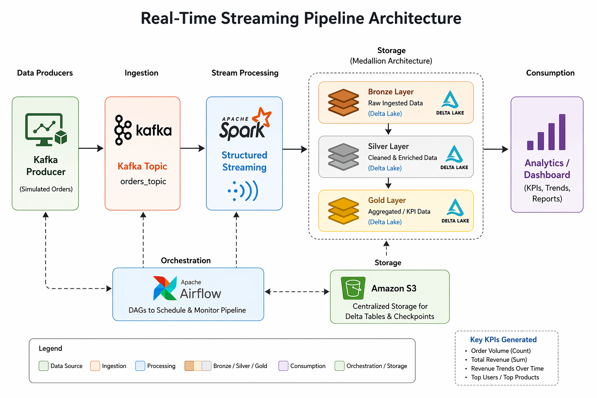

# 🚀 Real-Time Streaming Pipeline (Kafka + Spark)

## 📌 Overview
This project demonstrates a real-time data pipeline using Kafka and Spark Structured Streaming.

- Python producer generates streaming data
- Kafka acts as message broker
- Spark processes data in real-time

---

## 🏗️ Architecture


---

## ⚙️ Tech Stack
- Python
- Apache Kafka
- Apache Spark (Structured Streaming)
- Docker

---

## ▶️ How to Run

### Start Kafka & Zookeeper
```bash
docker-compose up -d
